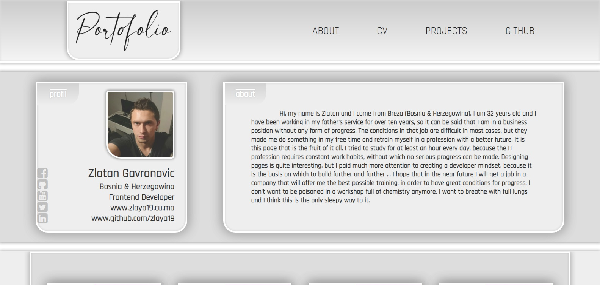

# myPortofolio

My portfolio site has a bunch of projects that i created in a past months. It's responsive and i added an animation as well.

...

Project 1 (Color generator)

Project 2 (Password generator)

Project 3 (Calculator)

Project 4 (Website example)

Project 5 (Portofolio example)

Project 6 (API number app) only localhost

Project 7 (API date app) only localhost

Project 8 (API years app) only localhost

Project 9 (API country app) doesn't work

Project 10 (Web-shop example)

Project 11 (Rock, paper & scissors game)

Project 12 (Pick the right cube)
